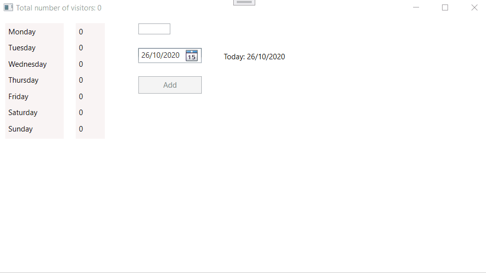

# Bijhouden van bezoekersaantallen in een array

De bezoekersaantallen worden per dag van de week bijgehouden. 
De gebruiker geeft een datum en een bezoekersaantal in. Dit wordt dan opgeteld bij de cijfers tot dan toe.

## Bijhouden gegevens
### Gegevens per dag
De gegevens per dag worden bijgehouden in een array. 
- Op index 0 worden de gegevens bijgehouden van de zondag.
- Op index 1 worden de gegevens bijgehouden van de maandag.
- Op index 2 worden de gegevens bijgehouden van de dinsdag.
### Algemeen totaal
Het totale bezoekersaantal wordt ook bijgehouden.

## Beginsituatie
Bij het opstarten 
- worden de dagen van de week in de linker stack panel toegevoegd. Hiervoor is de code reeds aanwezig.
- worden de bezoekersaantallen van de dagen getoond in de rechter stack panel.
- wordt het totaal aantal bezoekers weergegeven in de titelbalk
- wordt de cursor in txtVisitors geplaatst.
- wordt de systeemdatum getoond in dtpDate en lblToday.

## Check van de input
- De methode IsValidInteger gaat na of een doorgegeven tekst zonder problemen kan omgezet worden in een geheel getal
- De methode IsValidInput gaat na of de input voldoet aan de volgende voorwaarden:
  - er is een datum die niet in de toekomst ligt geselecteerd.
  - er is een bezoekersaantal ingevuld dat minstens 1 is.
  
De check van de input gebeurt bij elke wijziging in txtVisitors en dtpDate. 

Als de input geldig is, kan de btnAddVisitors gebruikt worden. Anders wordt die uitgeschakeld.

## Bezoekersaantallen ingeven
Bij een klik op de knop btnAddVisitors worden de gegeven datum en bezoekersaantal uitgelezen.

Via de methode IncreaseVisitors wordt het aantal bezoekers voor de weekdag van de doorgegeven datum verhoogd. Er wordt dus eerst nagegaan op welke dag van de week de doorgegeven datum valt. Daarna wordt aan de hand van de index de array met de bezoekersaantallen aangepast.

De bezoekersaantallen worden weergegeven in stpVisitors.

De cursor wordt in txtVisitors geplaatst en de input volledig geselecteerd.
